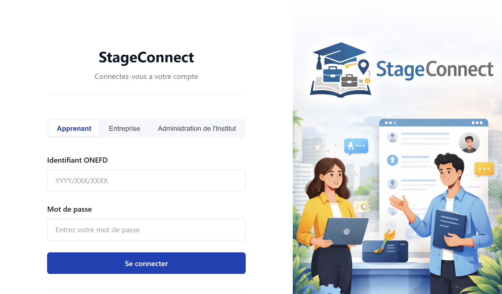

<div align="center">

# StageConnect

Full-stack internship management platform connecting students, companies, and institutions — built with Java EE, following the MVC architecture end to end.



</div>

---

## Overview

StageConnect matches students looking for internships with companies posting openings, with an admin layer supervising the whole platform. Adapted for the Algerian market — cities, specialties, and company data all reflect the local context. Students browse and filter offers, apply with a cover letter, and track application status; companies post and manage offers and review applicants; admins oversee users, offers, and applications platform-wide.

## Features

- **Three role types** — Student, Company, and Admin, each with a dedicated dashboard
- **Full application lifecycle** — post offer → apply → accept/reject → track status, with admin able to intervene at any stage
- **Smart filtering** — offers filterable by specialty, internship type, and geographic zone
- **One-application-per-offer constraint** enforced at the database level
- **Cascading data integrity** — deleting a user or offer cleanly cascades to related applications
- **Bilingual-ready structure** — built around a localized (French/Algerian) context, extensible to other locales
- **Responsive UI** tested across desktop, tablet, and mobile breakpoints

## Tech Stack


## Architecture

Classic Java EE layered MVC:

```
StagesPlatform/
├── src/main/java/com/stages/
│   ├── dao/       — data access layer (JDBC + PreparedStatement)
│   ├── model/     — POJOs (User, Entreprise, OffreStage, Candidature)
│   └── servlet/   — controllers, one per feature area (auth, student, company, admin)
└── src/main/webapp/
    ├── css/, js/, images/
    ├── includes/  — reusable navbar components per role
    └── *.jsp      — views (login, dashboards, offers, applications)
```

```
┌─────────────────────────────┐
│ PRESENTATION — JSP/HTML/CSS │
├─────────────────────────────┤
│ CONTROLLER — Servlets       │
├─────────────────────────────┤
│ BUSINESS LOGIC — Java POJOs │
├─────────────────────────────┤
│ DATA ACCESS — DAO + JDBC    │
├─────────────────────────────┤
│ PERSISTENCE — MySQL         │
└─────────────────────────────┘
```

**Database:** 5 relational tables (`apprenant`, `entreprise`, `offre_stage`, `candidature`, `admin`) with foreign keys on cascade delete, and a unique constraint preventing duplicate applications to the same offer.

## Security

- All queries use `PreparedStatement` — no string concatenation, SQL injection prevented at the DAO layer
- Session-based auth per role, with page-level session checks blocking unauthorized access
- JSTL `c:out` escaping against XSS on all user-rendered content

> Note: passwords are currently stored in plaintext in this academic build — bcrypt hashing, CSRF tokens, and HTTPS are flagged as the top pre-production requirements.

## Demo Credentials

| Role | Login | Password |
|---|---|---|
| Admin | `admin` | `admin123` |
| Student | `yassine.benkacem@etudiant.institut.dz` | `password123` |
| Company | `recrutement@ooredoo.dz` | `entreprise123` |

## Getting Started

**Requirements:** JDK 21, Apache Tomcat 10.1+, MySQL 8+

```bash
git clone https://github.com/riverimenemessadh/StageConnect.git
```

1. Create the database and import the schema:
```sql
CREATE DATABASE stages_db CHARACTER SET utf8mb4 COLLATE utf8mb4_unicode_ci;
```
Then import the provided `.sql` file (schema + seed data).

2. Configure the DB connection in `src/main/java/com/stages/dao/DatabaseConnection.java`:
```java
private static final String URL = "jdbc:mysql://localhost:3306/stages_db";
private static final String USER = "root";
private static final String PASSWORD = "";
```

3. Deploy on Tomcat (via Eclipse "Run on Server", or export as WAR to `<TOMCAT_HOME>/webapps/`).

4. Visit `http://localhost:8080/StagesPlatform/`.

## Contact

- [Portfolio](https://rivermessadhportfolio.netlify.app/)
- [LinkedIn](https://www.linkedin.com/in/river-messadh)
- [Upwork](https://www.upwork.com/freelancers/~017d459f20e3d30e04)
- [Email](mailto:sarahimenemessadh@gmail.com)
